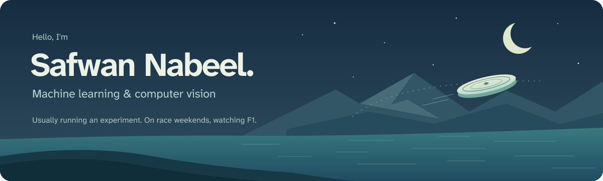
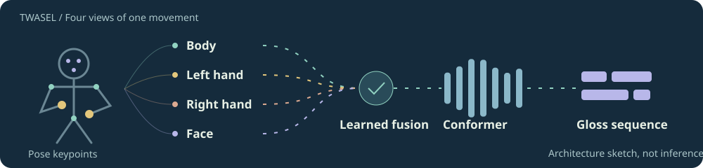
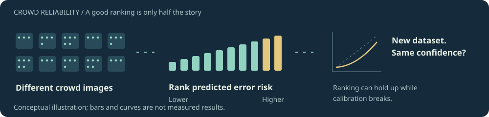
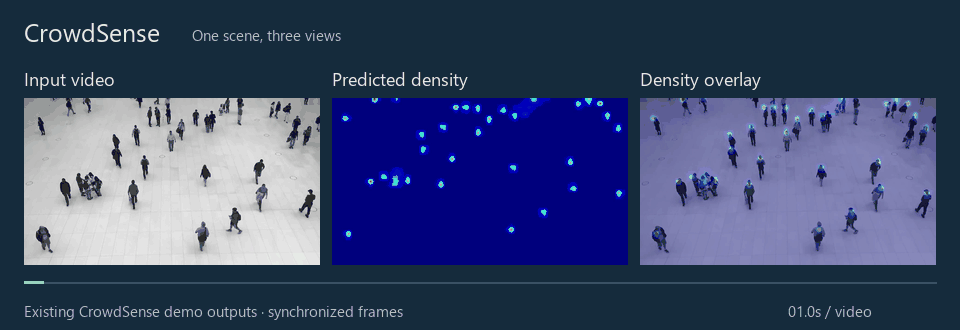

  
  
  
  
  

## 👋 A little about me

I got into computer vision through crowd counting. Our models struggled with people wearing shemaghs and hijabs, which made me think more about who was missing from the training data. Since then, I've been interested in understanding when models fail and whether we can spot unreliable predictions.

💻 I work as an **ML engineer** and mentor student research at **KAUST Academy**. 
🥏 Outside work: frisbee, photography, hiking, and board games.

## 🔬 Research

**TWASEL at SignEval 2026: Adaptive Multi-Stream Pose Fusion for Continuous Sign Language Recognition** 
Sadam Al-Azani, **Safwan Nabeel**, Qasim Al Mahfood, Mohanad Mohamed 
*CVPR Workshops 2026*

Recognizing sign language from body, hand, and facial movement. The model learns which signals to use over time and reached 16.62% word error rate on the SignEval test set.

 

**Are Crowd Counts Reliable? Post-Hoc Reliability Assessment for Crowd Counting Under Dataset Shift** 
**Safwan Nabeel**, Sadam Al-Azani, Muhammad Shahid Jabbar 
*Under review at IJCV*

Can a crowd-counting model tell which predictions are likely to be wrong? We estimate error risk without retraining the model, then test how well those estimates hold up on a different dataset.

Keeping the 80% of images ranked most reliable reduced mean absolute error by **19–68%** across seven settings, though calibration did not hold up reliably after dataset shift.

<!-- Hidden until the ACCV decision. Restore by removing the comment markers.
**Privacy and identity leakage in anonymized video** 
*Under review, ACCV 2026* 
A benchmark for residual identity leakage in privacy-preserving action recognition, attacked through face, body appearance, pose, gait, and learned features. Blurring a face is not the same as hiding a person.
-->

## 🧰 Projects

### CrowdSense

One scene, three views: the crowd, the predicted density, and the two together.

<a href="https://github.com/safwanx/CrowdSense">
  <picture>
    <source media="(prefers-reduced-motion: reduce)" srcset="assets/crowdsense-demo.png">
    
  </picture>
</a>

An excerpt from my existing demo outputs. The FastAPI app accepts an image and returns an estimated count and density overlay.

 · [Still frame](assets/crowdsense-demo.png)

**Video-to-text summarization**: YOLO selects frames, Florence-2 describes them, and Command R+ turns them into rolling one-minute summaries. Supports live and recorded video.

## 🛠️ Tools I use

## 🏅 A few highlights

- **2nd of 65** in Computer Information Systems at IAU, graduating with Second Honors.
- **2nd place**, GSR Hackathon at KFUPM, 2025.
- **Best Poster**, Undergraduate AI Projects Showcase at KFUPM, 2024.
- **1st place**, Cybersecurity category, Future Technologies, MCIT, 2024.
- **Global Top 10 &amp; People's Choice**, Kaspersky Secure IT Cup, 2023.

📬 If our research interests overlap, [say hello](mailto:safwanxnabeel@outlook.com).
